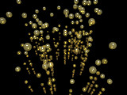

# bubble

Carbonated fluid bubble generator

Created by Charles Robertson, 14 July 2009;
modified by Richard Callwood III, 21 May 2025.

Optimised for POV-Ray 3.6, but works with 3.5...3.8.

Description: Creates columns of bubbles, representing CO₂ inside a fluid.

Bubbles increase in size the higher they ascend, in line with a decrease in fluid pressure.

Bubbles columns are placed randomly within a specified cylinder vector.

Bubble start end position can be modified.

Bubble start end radius can be modified.

Bubble column quantity can be modified.

Bubble texture can be modified.

In version 2.0, the texture can be omitted.
